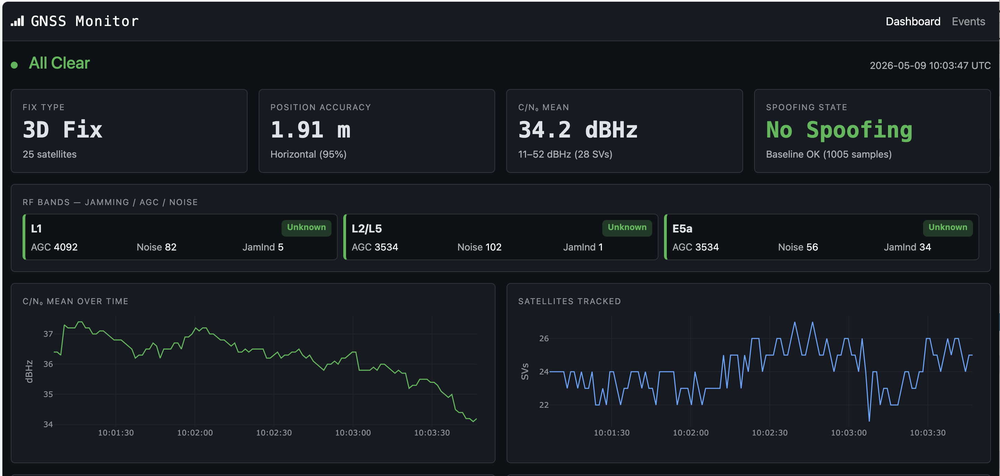

# GNSS Monitor



Real-time GNSS quality and threat monitor for the u-blox ZED-X20P, running on a Raspberry Pi 4. Detects jamming and spoofing using hardware threshold checks and statistical anomaly detection against a rolling baseline. Serves a live web dashboard.

## Hardware

| Component | Detail |
|-----------|--------|
| Compute | Raspberry Pi 4 (4 GB) |
| Receiver | u-blox ZED-X20P via USB (`/dev/ttyACM0`) |
| Antenna | u-blox ANN-MB2 (multi-band) |
| Firmware | HPG 2.02, protocol 50.10 |
| Constellations | GPS, Galileo, BeiDou, SBAS — GLONASS not supported on this hardware variant |

## What It Monitors

- **Fix quality** — fix type (no fix / 2D / 3D / RTK), satellite count, horizontal accuracy, pDOP
- **Per-satellite signal** — C/N₀, elevation, azimuth, quality indicator for all tracked SVs
- **RF bands** — per-band jamming state, AGC count, noise floor, jamming indicator (MON-RF)
- **Spoofing state** — hardware spoofing detection flag from NAV-STATUS

## Detection

Two complementary layers run on every sample:

**Hardware thresholds** (immediate, no baseline required):
- Jamming: MON-RF `jammingState ≥ 2` or `jamInd ≥ 80` on any band
- Spoofing: `spoofDetState ≥ 2` from NAV-STATUS

**Statistical z-score** (requires baseline):
- Satellite count drop
- C/N₀ mean drop (also used as a spoofing indicator when C/N₀ rises uniformly)
- AGC spike per band

Events are deduplicated — one open event per anomaly type/band. The baseline is a configurable rolling window (default 1 h, min 100 samples) recomputed from SQLite every 5 minutes.

## Dashboard

Live web UI at `http://<pi-ip>:5000` — pushed via WebSocket at ~1 Hz.

- Status badge (OK / Warning / Critical / No Fix)
- Fix type, satellite count, position accuracy, C/N₀ statistics
- RF band cards (L1, L2/L5, E5a) with AGC, noise, jamming indicator
- Spoofing detection state
- 2-minute rolling charts: C/N₀ mean, satellite count, L1 AGC, L1 jamming indicator
- Active alert banner
- Historical events page (`/events`) with type filter and timeline chart
- Baseline control (set duration 0.25–24 h)

## Architecture

```
ZED-X20P (/dev/ttyACM0)
    │  UBX binary, polling mode (~0.9 Hz)
    ▼
GNSSCollector thread
    │  Polls NAV-PVT, NAV-SAT, NAV-STATUS, MON-RF
    │  Collects response bytes for 1.1 s per cycle
    │  (NAV-PVT response deferred to next 1 Hz nav epoch)
    ▼
on_sample() callback
    ├── SQLite (gnss_samples, satellite_metrics, rf_metrics, events)
    ├── BaselineManager — rolling window mean/std
    ├── AnomalyDetector — threshold + statistical checks
    └── In-memory state + 2-min history ring buffer
            │
            ▼
Flask + Flask-SocketIO (threading mode)
    ├── GET  /            → dashboard
    ├── GET  /events      → event history
    ├── GET  /api/state   → current state JSON
    ├── GET  /api/history → time-series from DB
    └── WS   emit update  → push to browser every 1 s
```

**Key constraint**: the ZED-X20P NACKs CFG-PRT/CFG-MSG on USB — auto-output cannot be configured. The collector uses polling mode only. Input buffer is not reset between polls because the device auto-outputs NAV-SAT and NAV-STATUS at ~0.33 Hz.

## Setup

### Prerequisites (Pi)

```bash
pip install pyubx2==1.3.0 flask-socketio==5.6.1 PyYAML pyserial
sudo systemctl stop gpsd gpsd.socket   # must be inactive
```

### Deploy

```bash
# From local machine
./scripts/deploy.sh
```

Rsyncs source to `obs-pi-01@zenith.local:/home/obs-pi-01/gnss-monitor/`, installs the systemd service, and restarts it.

### Manual start (Pi)

```bash
cd ~/gnss-monitor
python3 app.py
```

### Service management (Pi — requires interactive terminal)

```bash
sudo systemctl start gnss-monitor
sudo systemctl restart gnss-monitor
journalctl -u gnss-monitor -f
```

## Configuration

`config.yaml` — key settings:

| Key | Default | Description |
|-----|---------|-------------|
| `device.port` | `/dev/ttyACM0` | Serial port |
| `baseline.duration_hours` | `1.0` | Rolling baseline window (0.25–24 h) |
| `baseline.min_samples` | `100` | Minimum samples before baseline is active |
| `detection.statistical.zscore_threshold` | `3.0` | Anomaly trigger threshold (consider 3.5–4.0 to reduce false positives) |
| `detection.threshold.jam_indicator_warn` | `80` | jamInd threshold (0–255) |
| `storage.retain_days` | `90` | SQLite retention window |
| `web.port` | `5000` | Dashboard port |

## Operational Notes

- After relocating the antenna, clear the baseline: `DELETE FROM baseline_stats` in the SQLite DB and restart the service.
- Use `-P 50.10` (not `-P 18.00`) when running `ubxtool` against this device.
- QZSS is supported by the hardware but disabled — not visible at 53.5°N.
